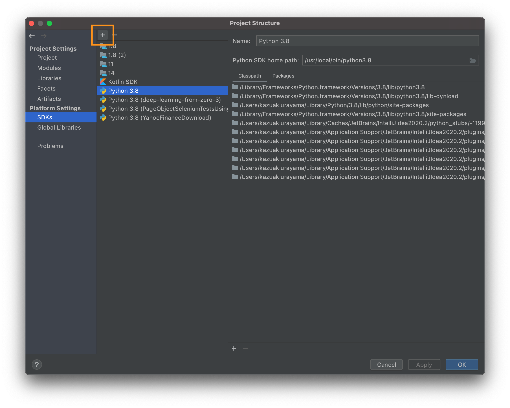
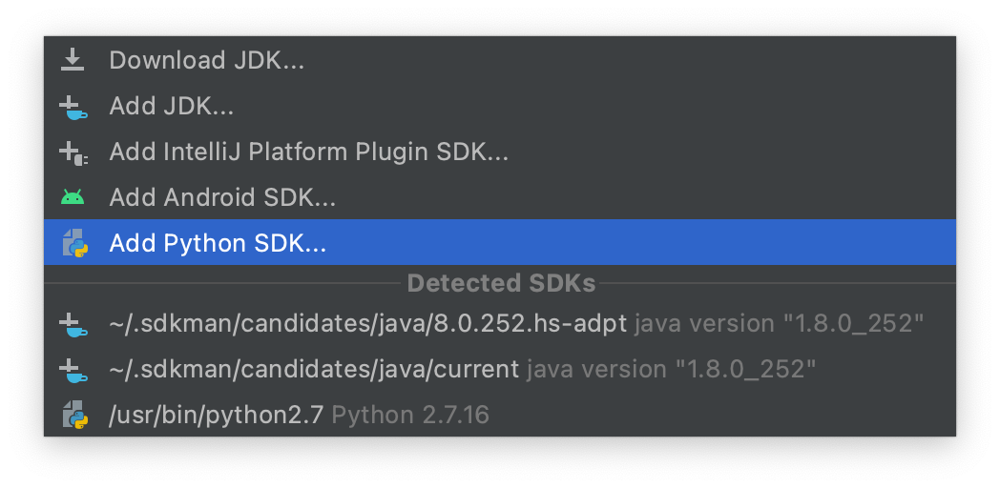
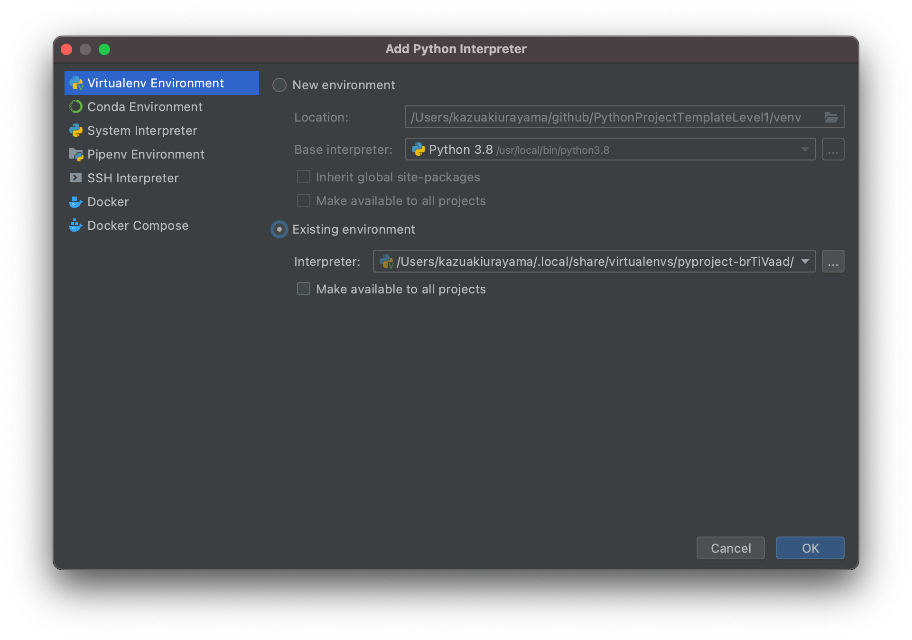
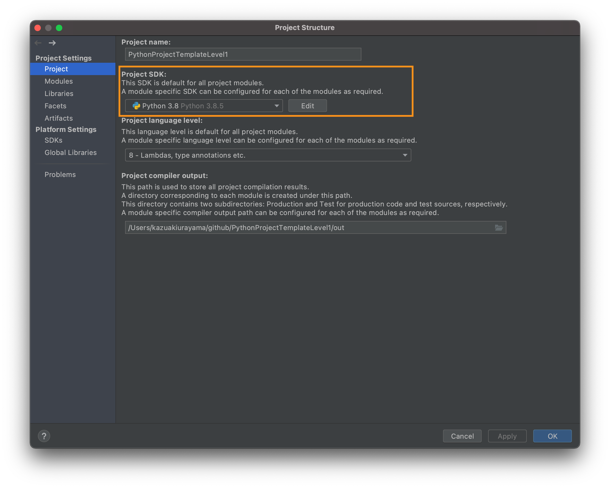
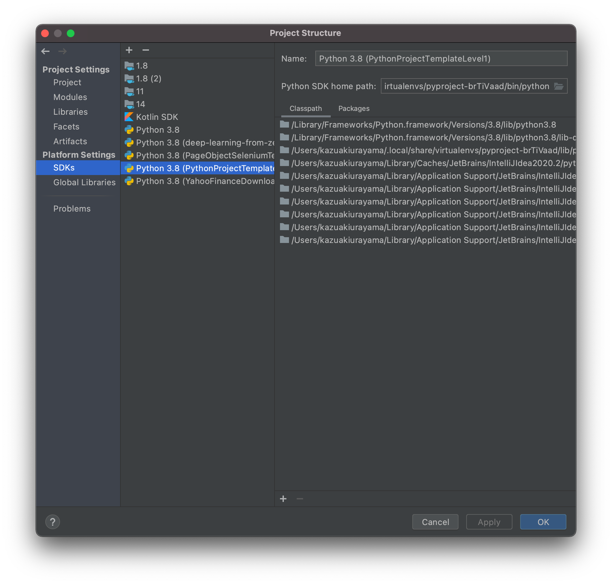
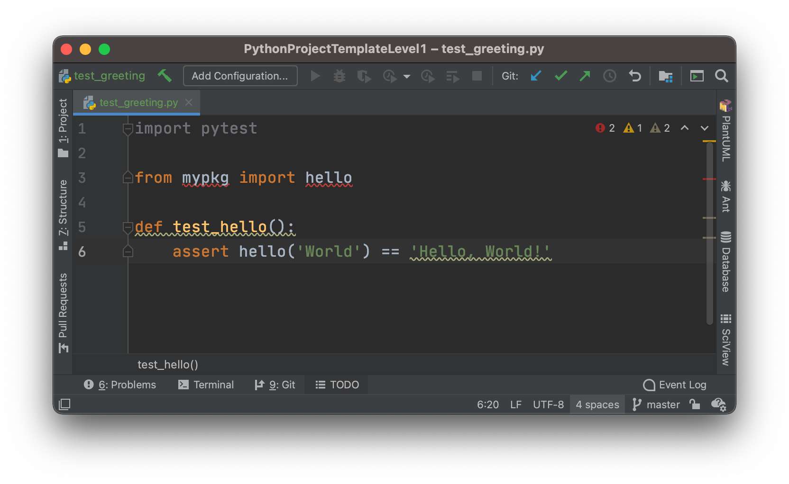
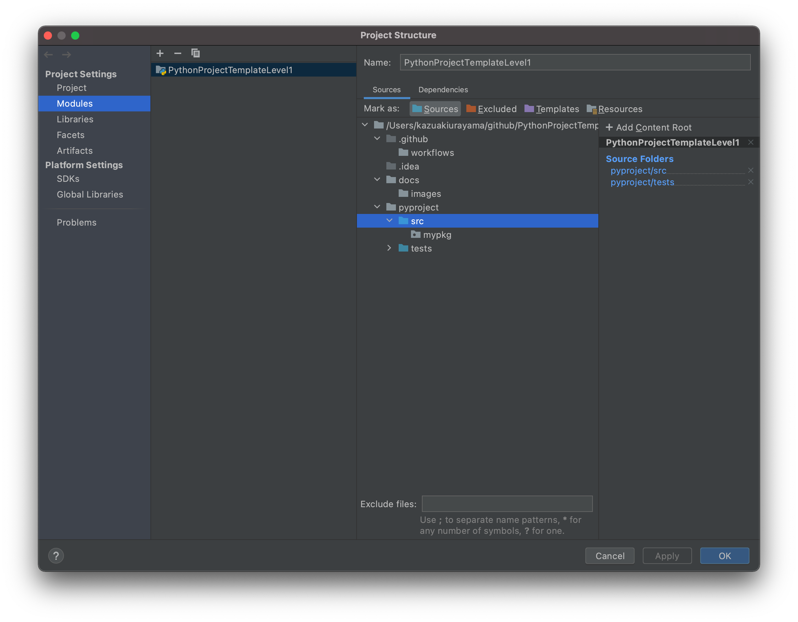

# Pythonプロジェクトのテンプレート　レベル1

- @author kazurayam
- @date Feb 2021

<!-- START doctoc generated TOC please keep comment here to allow auto update -->
<!-- DON'T EDIT THIS SECTION, INSTEAD RE-RUN doctoc TO UPDATE -->
<details>
<summary>Table of Contents</summary>

- [これは何か](#%E3%81%93%E3%82%8C%E3%81%AF%E4%BD%95%E3%81%8B)
- [前提条件](#%E5%89%8D%E6%8F%90%E6%9D%A1%E4%BB%B6)
- [達成目標](#%E9%81%94%E6%88%90%E7%9B%AE%E6%A8%99)
- [手順](#%E6%89%8B%E9%A0%86)
  - [pyenv経由でAnacondaをインストールする](#pyenv%E7%B5%8C%E7%94%B1%E3%81%A7anaconda%E3%82%92%E3%82%A4%E3%83%B3%E3%82%B9%E3%83%88%E3%83%BC%E3%83%AB%E3%81%99%E3%82%8B)
  - [プロジェクトのためにディレクトリを作る](#%E3%83%97%E3%83%AD%E3%82%B8%E3%82%A7%E3%82%AF%E3%83%88%E3%81%AE%E3%81%9F%E3%82%81%E3%81%AB%E3%83%87%E3%82%A3%E3%83%AC%E3%82%AF%E3%83%88%E3%83%AA%E3%82%92%E4%BD%9C%E3%82%8B)
  - [pipenvで仮想環境を作る](#pipenv%E3%81%A7%E4%BB%AE%E6%83%B3%E7%92%B0%E5%A2%83%E3%82%92%E4%BD%9C%E3%82%8B)
    - [pipenvをインストールする](#pipenv%E3%82%92%E3%82%A4%E3%83%B3%E3%82%B9%E3%83%88%E3%83%BC%E3%83%AB%E3%81%99%E3%82%8B)
    - [プロジェクト固有のPython開発環境を作る](#%E3%83%97%E3%83%AD%E3%82%B8%E3%82%A7%E3%82%AF%E3%83%88%E5%9B%BA%E6%9C%89%E3%81%AEpython%E9%96%8B%E7%99%BA%E7%92%B0%E5%A2%83%E3%82%92%E4%BD%9C%E3%82%8B)
    - [外部パッケージを追加する](#%E5%A4%96%E9%83%A8%E3%83%91%E3%83%83%E3%82%B1%E3%83%BC%E3%82%B8%E3%82%92%E8%BF%BD%E5%8A%A0%E3%81%99%E3%82%8B)
    - [プロジェクト固有のPython仮想環境を別マシンで再現する](#%E3%83%97%E3%83%AD%E3%82%B8%E3%82%A7%E3%82%AF%E3%83%88%E5%9B%BA%E6%9C%89%E3%81%AEpython%E4%BB%AE%E6%83%B3%E7%92%B0%E5%A2%83%E3%82%92%E5%88%A5%E3%83%9E%E3%82%B7%E3%83%B3%E3%81%A7%E5%86%8D%E7%8F%BE%E3%81%99%E3%82%8B)
    - [開発環境だけで使うパッケージを別枠で管理する](#%E9%96%8B%E7%99%BA%E7%92%B0%E5%A2%83%E3%81%A0%E3%81%91%E3%81%A7%E4%BD%BF%E3%81%86%E3%83%91%E3%83%83%E3%82%B1%E3%83%BC%E3%82%B8%E3%82%92%E5%88%A5%E6%9E%A0%E3%81%A7%E7%AE%A1%E7%90%86%E3%81%99%E3%82%8B)
    - [Pipfileにスクリプトを登録する](#pipfile%E3%81%AB%E3%82%B9%E3%82%AF%E3%83%AA%E3%83%97%E3%83%88%E3%82%92%E7%99%BB%E9%8C%B2%E3%81%99%E3%82%8B)
    - [仮想環境に入ってシェルを実行する](#%E4%BB%AE%E6%83%B3%E7%92%B0%E5%A2%83%E3%81%AB%E5%85%A5%E3%81%A3%E3%81%A6%E3%82%B7%E3%82%A7%E3%83%AB%E3%82%92%E5%AE%9F%E8%A1%8C%E3%81%99%E3%82%8B)
    - [.envの自動読み込み](#env%E3%81%AE%E8%87%AA%E5%8B%95%E8%AA%AD%E3%81%BF%E8%BE%BC%E3%81%BF)
    - [Pipfileからrequirements.txtを生成する](#pipfile%E3%81%8B%E3%82%89requirementstxt%E3%82%92%E7%94%9F%E6%88%90%E3%81%99%E3%82%8B)
  - [IntelliJ IDEAでPythonプロジェクトを開発する準備をする](#intellij-idea%E3%81%A7python%E3%83%97%E3%83%AD%E3%82%B8%E3%82%A7%E3%82%AF%E3%83%88%E3%82%92%E9%96%8B%E7%99%BA%E3%81%99%E3%82%8B%E6%BA%96%E5%82%99%E3%82%92%E3%81%99%E3%82%8B)
    - [Platform SDKとして追加する](#platform-sdk%E3%81%A8%E3%81%97%E3%81%A6%E8%BF%BD%E5%8A%A0%E3%81%99%E3%82%8B)
    - [Project SDKとして登録する](#project-sdk%E3%81%A8%E3%81%97%E3%81%A6%E7%99%BB%E9%8C%B2%E3%81%99%E3%82%8B)
  - [ユニットテストを実行する](#%E3%83%A6%E3%83%8B%E3%83%83%E3%83%88%E3%83%86%E3%82%B9%E3%83%88%E3%82%92%E5%AE%9F%E8%A1%8C%E3%81%99%E3%82%8B)
    - [pytestをインストールする](#pytest%E3%82%92%E3%82%A4%E3%83%B3%E3%82%B9%E3%83%88%E3%83%BC%E3%83%AB%E3%81%99%E3%82%8B)
    - [ユニットテストのコード](#%E3%83%A6%E3%83%8B%E3%83%83%E3%83%88%E3%83%86%E3%82%B9%E3%83%88%E3%81%AE%E3%82%B3%E3%83%BC%E3%83%89)
    - [テストコードを格納するためにディレクトリ構造をどうするか](#%E3%83%86%E3%82%B9%E3%83%88%E3%82%B3%E3%83%BC%E3%83%89%E3%82%92%E6%A0%BC%E7%B4%8D%E3%81%99%E3%82%8B%E3%81%9F%E3%82%81%E3%81%AB%E3%83%87%E3%82%A3%E3%83%AC%E3%82%AF%E3%83%88%E3%83%AA%E6%A7%8B%E9%80%A0%E3%82%92%E3%81%A9%E3%81%86%E3%81%99%E3%82%8B%E3%81%8B)
    - [コマンドラインでpytest実行時にimportがエラーになるで問題](#%E3%82%B3%E3%83%9E%E3%83%B3%E3%83%89%E3%83%A9%E3%82%A4%E3%83%B3%E3%81%A7pytest%E5%AE%9F%E8%A1%8C%E6%99%82%E3%81%ABimport%E3%81%8C%E3%82%A8%E3%83%A9%E3%83%BC%E3%81%AB%E3%81%AA%E3%82%8B%E3%81%A7%E5%95%8F%E9%A1%8C)
    - [IntelliJ IDEAのエディタでimportがエラーになる件](#intellij-idea%E3%81%AE%E3%82%A8%E3%83%87%E3%82%A3%E3%82%BF%E3%81%A7import%E3%81%8C%E3%82%A8%E3%83%A9%E3%83%BC%E3%81%AB%E3%81%AA%E3%82%8B%E4%BB%B6)
- [まとめ](#%E3%81%BE%E3%81%A8%E3%82%81)
- [補足](#%E8%A3%9C%E8%B6%B3)
  - [READMEに目次をつけた](#readme%E3%81%AB%E7%9B%AE%E6%AC%A1%E3%82%92%E3%81%A4%E3%81%91%E3%81%9F)

</details>
<!-- END doctoc generated TOC please keep comment here to allow auto update -->

## これは何か

Python言語でプログラムを自作したい。そのために環境を作り道具を揃えて使えるようにする必要がある。アプリケーションが何であれ環境と道具は概ね同じであり、繰り返し利用しつつ磨き上げていくものだ。Python初心者のわたしがやってきた準備作業を細かく記録しつつレポジトリとして保存しよう。さまざまなPythonプロジェクトの雛形として使えるだろう。

Gitレポジトリを4つ作る。

1. [PythonProjectTemplateLevel1](https://github.com/kazurayam/PythonProjectTemplateLevel1) --- つまりこのレポジトリ。Python処理系をインストールする。pipenvで仮想環境を構築する。わたし流のディレクトリ構造を決める。IntelliJ IDEAを設定する。pytestでユニットテストする。
1. [PythonProjectTemplateLevel2](https://github.com/kazurayam/PythonProjectTemplateLevel2) --- わたしのPythonコードをpipでライブラリにしてPyPIにアップロードして共有可能にする。そのライブラリを仕込んだDockerイメージを作りDocker Hubにアップロードして共有可能にする。
1. [PythonProjectTemplateLevel3](https://github.com/kazurayam/PythonProjectTemplateLevel3) --- 単純なWebサーバアプリケーションを作る。Laravelフレームワークで。Dockerイメージを作る。
1. [PythonProjectTemplateLevel4](https://github.com/kazurayam/PythonProjectTemplateLevel4) --- Laravelで作ったWebサーバアプリのユーザインタフェースをSeleniumでテストする。Page Objectモデルで。

## 前提条件

1. マシンはMac Book Air、OSは macOS 11.1 Big Sur。
1. MacにHomebrewをインストール済み、説明は省略する
1. MacにGitをインストール済み、Git Hubに自分のアカウントを持っていて、Gitの操作に熟達していると前提するので説明は省略する。
1. MacでIntelliJ IDEAを開発環境として使う。IDEAのライセンスを持っていてPythonプラグインをインストール済みと前提する。

## 達成目標

Level1では下記のことを達成することを目標とする。

1. Python処理系をマシンにインストールする。Python 3.8をメインとし、Python 3.9も使えるようにする。各プロジェクトがPythonインタープレタのバージョンを切り替えられるようにしたい。[pyenv]() を経由して複数バージョンの[Anaconda](https://www.anaconda.com/) をインストールする。そして特定のバージョンのAnacondaを選択する。
1. プロジェクトのディレクトリ構造をどうするか、自分はこうするという形を決める。
1. Python仮想環境を作る。つまりプロジェクトそれぞれのためにPython処理系のバージョンを選択し、外部ライブラリとそのバージョンを選択できるようにし、他のプロジェクトに影響を及ぼさないよう分離する。このために [pipenv](https://pypi.org/project/pipenv/) を利用する。
1. 上記で作ったプロジェクト専用のPython仮想環境をIntelliJ IDEAにPython SDKの一つとして追加する。そして本プロジェクトのためのSDKとしてそれを登録する。これにより本プロジェクト専用の仮想環境がIntelliJ IDEAから使えるようになる。
1. [pytest](https://docs.pytest.org/en/stable/) を導入しユニットテストを書き、実行する。

## 手順

### pyenv経由でAnacondaをインストールする

この記事を参考にした。

- [【2021年最新版】MacOSで複数のPython/Anacondaバージョンを使い分ける方法【データ分析】](https://www.simpletraveler.jp/2021/01/02/macos-pyenv-python-anaconda-versionmanagement/#pyenvMac)

[pyenv](https://github.com/pyenv/pyenv)は複数のバージョンのPython処理系を管理するためのツール。

pyenvをインストールする。

```
$ brew install pyenv
```

pyenvのパスをMacの.bash_profileに記述する。

```
export PYENV_ROOT="$HOME/.pyenv"
export PATH="$PYENV_ROOT/bin:$PATH"
eval "$(pyenv init -)"
```

なおmacOS11ではデフォルトではzshを使うことになっているが、個人的好みのせいでわたしはいまだにbashです。

pyenvを使って特定バージョンのAnacondaをインストールする

```
$ pyenv install --list | grep anaconda
  ...
  anaconda3-4.4.0
  ...
  anaconda3-5.3.1
  ...
```
たくさんリストアップされた候補の中からanaconda3-4.4.0とanaconda3-5.3.1の二つをインストールすることにした。

```
$ pyenv install anaconda3-4.4.0
```

そして

```
$ pyenv install anaconda3-5.3.1
```

わたしの環境ではそれぞれ10分ぐらいかかった。

コマンドラインで`python`コマンドを投入した時にどのバージョンが使われるかを確認しよう。

```
$ pyenv versions
* system (set by /Users/kazuakiurayama/.pyenv/version)
  anaconda3-4.4.0
  anaconda3-5.3.1
```

`system`に*がついています。macOSにプレインストールされたものが選択がされてい流。追加したanacondaが選択されていません。これではつまらない。

`pyenv global バージョン`コマンドで設定を切り替えます。今からはanaconda3-4.4.0を使うことにしましょう。

```
$ pyenv global anaconda3-4.4.0
:~
$ pyenv versions
  system
* anaconda3-4.4.0 (set by /Users/kazuakiurayama/.pyenv/version)
  anaconda3-5.3.1
```

これでanaconda3-4.4.0に切り替わりました。

なお特定のディレクトリにcdしてから `pyenv local anaconda3-5.3.1` とやればそのディレクトリのしたではglobalに指定したのと別のPython環境を使うことができます。

pyenvでインストールしたバージョンをアンインストールするにはこうします。

```
$ pyenv uninstall バージョン名
```

### プロジェクトのためにディレクトリを作る

本プロジェクトのためにディレクトリを作ります。場所は適宜。mkdirで。

```
$ cd
$ cd github
$ mkdir PythonProjectTemplateLevel1
$ cd PythonProjectTemplateLevel1
$ pwd
~/github/PythonProjectTemplateLevel1
```

以下の記述では `~/github/PythonProjectTemplateLevel1` を手短に `$repo` と書くことにします。

`$repo`の下に下記のようなディレクトリ構造を作ります。
```
$ pwd
/Users/kazuakiurayama/github/PythonProjectTemplateLevel1
:~/github/PythonProjectTemplateLevel1 (master *)
$ tree .
.
├── README.md
└── pyproject
    ├── src
    └── tests
```

サブフォルダ `pyproject` を作りました。このフォルダの下にPythonによるアプリケーションを開発する環境を作ることにします。なぜ`$repo`の下にサブフォルダを作ったかというと、Pythonではない別のテクノロジーを用いるコードやライブラリ類（たとえばExcelファイルやchromedriverのバイナリやシェルスクリプトとか）のために別のサブフォルダを作れるようにという考えです。別種のテクノロジーを用いる複数のサブフォルダをまとめて一つのGitレポジトリにまとめて管理できるようにしました。

### pipenvで仮想環境を作る

[pipenv](https://pypi.org/project/pipenv/) はPython仮想環境を作るツールです。下記の記事を参考にした。

- [Qiita Pipenvを使ったPython開発まとめ](https://qiita.com/y-tsutsu/items/54c10e0b2c6b565c887a)

#### pipenvをインストールする

pyenvで選択したanacondaにpipenvをインストールします。

```
$ pip install pipenv
```

#### プロジェクト固有のPython開発環境を作る

`$repo/pyproject` ディレクトリにcdします。そして次のコマンドを投入する。すると自動的に仮想環境が作られます。

```
$ cd $repo/pyproject
$ pipenv --python 3
Creating a virtualenv for this project...
Pipfile: /Users/kazuakiurayama/github/PythonProjectTemplateLevel1/pyproject/Pipfile
Using /usr/local/bin/python3.8 (3.8.5) to create virtualenv...
⠸ Creating virtual environment...created virtual environment CPython3.8.5.final.0-64 in 1637ms
  creator CPython3Posix(dest=/Users/kazuakiurayama/.local/share/virtualenvs/pyproject-brTiVaad, clear=False, no_vcs_ignore=False, global=False)
  seeder FromAppData(download=False, pip=bundle, setuptools=bundle, wheel=bundle, via=copy, app_data_dir=/Users/kazuakiurayama/Library/Application Support/virtualenv)
    added seed packages: pip==21.0.1, setuptools==52.0.0, wheel==0.36.2
  activators BashActivator,CShellActivator,FishActivator,PowerShellActivator,PythonActivator,XonshActivator

✔ Successfully created virtual environment! 
Virtualenv location: /Users/kazuakiurayama/.local/share/virtualenvs/pyproject-brTiVaad
Creating a Pipfile for this project...
$ ls
Pipfile	src	test
```

前述した手順でインストールしたanaconda3-4.4.0にインストール済みのバージョンのPython3.xが選ばれてそれを使うように仮想環境が初期化されます。

Python仮想環境がどこのディレクトリに作られたのか？下記のコマンドで調べることができます。

```
$repos/pyproject $ pipenv --venv
$ pipenv --venv
/Users/myname/.local/share/virtualenvs/pyproject-brTiVaad
```

$repos/projectディレクトリの下ではなくて、別の場所にできていることに注目しましょう。後でIntelliJ IDEAにPlatform SDKを追加するときにこのパスを指定することになります。
仮想環境はGitによるバージョン管理に含めるべきではありません。だから$reposの下ではなく別の場所に仮想環境が作られるのは好都合です。


#### 外部パッケージを追加する

`requests`パッケージを仮想環境にインストールしてみましょう。

```
:$repos/pyproject (master *+)
$ pipenv install requests
Installing requests...
Adding requests to Pipfile's [packages]...
✔ Installation Succeeded 
Pipfile.lock not found, creating...
Locking [dev-packages] dependencies...
Locking [packages] dependencies...
Building requirements...
Resolving dependencies...
✔ Success! 
Updated Pipfile.lock (fbd99e)!
Installing dependencies from Pipfile.lock (fbd99e)...
  🐍   ▉▉▉▉▉▉▉▉▉▉▉▉▉▉▉▉▉▉▉▉▉▉▉▉▉▉▉▉▉▉▉▉ 0/0 — 00:00:00
To activate this project's virtualenv, run pipenv shell.
Alternatively, run a command inside the virtualenv with pipenv run.
```

pipenvからパッケージをインストールするとPipfileに`[packages]`の記述が自動的に追加されます。

```
$ cat Pipfile
[[source]]
url = "https://pypi.org/simple"
verify_ssl = true
name = "pypi"

[packages]
requests = "*"

[dev-packages]

[requires]
python_version = "3.8"
```

またこの時 `Pipfile.lock` ファイルが自動的に追加されます。

```
$ ls
Pipfile		Pipfile.lock	src		test
```

`Pipfile`と`Pipfile.lock`にはこのプロジェクトのために仮想環境に追加インストールされたパッケージに関する詳細な情報が記録されます。

#### プロジェクト固有のPython仮想環境を別マシンで再現する
 
PipfileとPipfile.lockの二つのファイルをGitレポジトリに追加して共有しよう。これにより、ほかの開発者が別のマシンで同じPython仮想環境を再現することが簡単にできる。これがpipenvを使うことのメリットの第一。

別マシンにGitレポジトリをcloneした後でPython仮想環境を再現するにはこうします。

Pipfileを入力としてパッケージを再インストールするにはこうする。
```
$ cd $anotherrepos/pyproject
$ pipenv install
$ pipenv install --dev
```

PipfileではなくPipfile.lockから詳細バージョンもきっちり合わせて環境を再現するにはこうする。
```
$ cd $anotherrepos/pyproject
$ pipenv sync
$ pipenv sync --dev
```


#### 開発環境だけで使うパッケージを別枠で管理する

通常のパッケージの他に開発環境でだけ使うパッケージを別枠で管理しながらインストールすることもできる。たとえば[`autopep8`](https://githubja.com/hhatto/autopep8)をインストールしてみよう。

```
$ cd $repo/pyproject
$ pipenv install --dev autopep8
```
するとPipfileがこうなる。`[dev-packages]`にautopep8が記入されていることに注目。
```
$ cat Pipfile
[[source]]
url = "https://pypi.org/simple"
verify_ssl = true
name = "pypi"

[packages]
requests = "*"

[dev-packages]
autopep8 = "*"

[requires]
python_version = "3.8"
```

#### Pipfileにスクリプトを登録する

Pipefileの `[scripts]` に短いシェルスクリプトを記述し名前をつけて登録することができます。プロダクトのmainスクリプトを起動する、ユニットテストを実行する、Pythonコードを生成する、Lintツールを実行する、など頻繁に実行するコマンドを登録しておけば便利です。

```
[scripts]
test = "python -m pytest"
format = "autopep8 -ivr ."
```

testスクリプトを実行するにはこうします。

```
$repos/pyproject $ pipenv run test
```

#### 仮想環境に入ってシェルを実行する

```
$repos/pyproject $ pipenv shell
$ pipenv shell
Launching subshell in virtual environment...
 . /Users/kazuakiurayama/.local/share/virtualenvs/pyproject-brTiVaad/bin/activate
:~/github/PythonProjectTemplateLevel1/pyproject (master *+)
$  . /Users/kazuakiurayama/.local/share/virtualenvs/pyproject-brTiVaad/bin/activate
(pyproject) :~/github/PythonProjectTemplateLevel1/pyproject (master *+)

```

```
$ exit
exit
```

#### .envの自動読み込み

プロジェクトに `.env` ファイルを用意しておくと `pepenv run` や `pipenv shell` を実行するときに自動で読み込んでくれる。認証情報などハードコードするにはまずい情報を登録しておくのに便利。ただし `.gitignore` に書いて `.env` を除外するのを忘れずに。

```.env
username=John Doe
password=ThisIsNotAPassword
DEBUG=1
```

シェルの環境変数にDEBUGその他が追加されます。確認してみましょう。
```
$repos/pyproject $ 
pipenv run python
Loading .env environment variables...
Python 3.8.5 (v3.8.5:580fbb018f, Jul 20 2020, 12:11:27) 
[Clang 6.0 (clang-600.0.57)] on darwin
Type "help", "copyright", "credits" or "license" for more information.
>>> import os
>>> os.environ['DEBUG']
'1'
>>> os.environ['username']
'John Doe'
>>> os.environ['password']
'ThisIsNotAPassword'
```

#### Pipfileからrequirements.txtを生成する

ちなみに[PythonProjectTemplateLevel2](https://github.com/kazurayam/PythonProjectTemplateLevel2) で自作のPythonコードをライブラリにするとき `requirements.txt` ファイルが必要になります。Pipenvでインストールした外部依存ライブラリの詳細を `requirements.txt` に書き出すことができます。下記のコマンドを使う。
```
$ cd $repo/pyproject
$ pipenv run pip freeze > requirements.txt
```
このテクニックを使えば外部依存ライブラリの管理をPipenvに一元化しつつ、pipコマンドでライブラリ化する作業をすることができます。


### IntelliJ IDEAでPythonプロジェクトを開発する準備をする

PythonProjectTemplateLevel1をIntelliJ IDEAで開発するための準備をしよう。IntelliJ IDEAのライセンスを購入しインストール済み、かつPython pluginがインストール済みであることを前提する。

本プロジェクトのために作ったPython仮想環境をIntelliJ IDEAの中でも使いたい。そのためにはIDEAにそのPython仮想環境のありかを教え無ければならない。そのために二つの作業をする。

1. IntelliJ IDEAに Platform SDK の一つとして追加登録する。
1. IDEAでPythonProjectTemplateLevel1をプロジェクトとして開いたあとで当該プロジェクトの Project SDKとして、先に追加登録したPlatform SDKを選択する。

#### Platform SDKとして追加する

IntelliJ IDEAを起動する。ツールバーで *File > Project Structure...* を選ぶ。 ダイアログのメニューで *Platform Settings > SDKs* を選ぶ。Platform SDK として
新しい仮想環境を追加したいので、＋ のボタンを押す。



ドロップダウンメニューが表示されるので *Add Python SDK...* を選ぶ。



*Add Python Interpreter* と題するダイアログが開く。



ダイアログのメニューから *Virtualenv Environment* を選ぶ。 *New Environment* ではなく *Existing Environment* を選ぶ。*Interpreter* として本プロジェクトのために準備したPython仮想環境のなかの `python` を指定する。

でも仮想環境ってどこにあるんだっけ？ ... 下記のコマンドで調べられる。
```
$repos/pyproject $ pipenv --venv
/Users/myname/.local/share/virtualenvs/pyproject-brTiVaad
```

*Interpreter*としては pythonのバイナリファイルのパスを指定する必要がある。具体的にはこうだった。

- Interpreter: `/Users/myname/.local/share/virtualenvs/pyproject-brTiVaad/bin/python`

Platform SDKの名前を `Python 3.8 (PythonProjectTemplateLevel1)` という風に区別しやすい名前にした上でOKボタンを押せ。

#### Project SDKとして登録する

Platform SDKとして `Python 3.8 (PythonProjectTemplateLevel1)` を追加したが、それだけでは足りない。
`PythonProjectTemplateLevel1` プロジェクトのProject SKDとしてこのPlatform SDKを選ぶという設定を加える必要がある。

IntelliJ IDEAを起動し、`PythonProjectTemplateLevel1`をプロジェクトとして開く。ツールバーで *File > Project Structure...* を選ぶ。 ダイアログのメニューで *Project Settings > Project* を選ぶ。



*Project SDK* にデフォルト値が設定されているが、これを書き替えたい。*Edit*ボタンを押せ。すると登録ずみのPlatform SDKのリストが表示される。リストの中から `Python 3.8 (PythonProjectTemplateLevel1)` を選べ。そしてOKせよ。



これでIntelliJ IDEAにSDKを登録する作業は完了だ。

### ユニットテストを実行する

`PythonProjectTemplateLevel1`プロジェクトのためにPython仮想環境を準備し、IntelliJ IDEAを設定することができた。ではPythonコードを一つ書いて、ユニットテストを実行してみよう。

下記の記事を参照した。

- [pytest入門 - 闘うITエンジニアの覚え書き](https://www.magata.net/memo/index.php?pytest%C6%FE%CC%E7#q4177cd9)

#### pytestをインストールする

まずpytestを仮想環境にインストールしよう。

```
$repos/pyproject (main *)
$ pipenv install pytest --dev
```

#### ユニットテストのコード

アプリケーションのコード `$repos/pyroject/src/mypkg/greeting.py` を書いた。

```
def hello(name):
    return 'Hello, ' + name
```

ユニットテストのコード `$repos/pyproject/tests/mypkg/test_greeting.py` を書いた。

```
import pytest

from mypkg import greeting

def test_hello():
    assert greeting.hello('World') == 'Hello, World!'
```

#### テストコードを格納するためにディレクトリ構造をどうするか

ディレクトリ構造を下記のようにした。アプリケーション本体のコードを `$repos/pyroject/src` ディレクトリに格納し、ユニットテストのコードを `$repos/pyproject/tests` ディレクトリに格納している。このほうがきれいだから。

`$repos/pyproject/src/mypkg/__init__.py` を作っている。これによって `mypkg` という名前のPythonパッケージを定義したつもり。

```
$ tree .
.
└── pyproject
    ├── Pipfile
    ├── Pipfile.lock
    ├── src
    │   └── mypkg
    │       ├── __init__.py
    │       └── greeting.py
    └── tests
        ├── __init__.py
        └── mypkg
            ├── __init__.py
            └── test_greeting.py
```

`tests/__init__.py`ファイルが作ってあることに注意。これには理由がある。あとで説明する。``


#### コマンドラインでpytest実行時にimportがエラーになるで問題

コマンドラインでpytestを実行してみた。

```
:~/github/PythonProjectTemplateLevel1/pyproject (master *+)
$ pipenv run pytest
Loading .env environment variables...
============================= test session starts ==============================
platform darwin -- Python 3.8.5, pytest-6.2.2, py-1.10.0, pluggy-0.13.1
rootdir: /Users/myname/github/PythonProjectTemplateLevel1/pyproject
collected 0 items / 1 error                                                    

==================================== ERRORS ====================================
___________________ ERROR collecting tests/test_greeting.py ____________________
ImportError while importing test module '/Users/myname/github/PythonProjectTemplateLevel1/pyproject/tests/test_greeting.py'.
Hint: make sure your test modules/packages have valid Python names.
Traceback:
/Library/Frameworks/Python.framework/Versions/3.8/lib/python3.8/importlib/__init__.py:127: in import_module
    return _bootstrap._gcd_import(name[level:], package, level)
tests/test_greeting.py:1: in <module>
    from mypkg import greeting
E   ModuleNotFoundError: No module named 'mypkg'
=========================== short test summary info ============================
ERROR tests/test_greeting.py
!!!!!!!!!!!!!!!!!!!! Interrupted: 1 error during collection !!!!!!!!!!!!!!!!!!!!
=============================== 1 error in 0.12s ===============================
```

`test_generating.py` の1行目に書いてある `from mypkg import greeting` がエラーになっている。`mypkg`パッケージを見つけることができていない。Pythonの `sys.path` のなかに `$repos/pyproject/src` ディレクトリが入っていないから、`mypkg`パッケージを見つけることができないのだ。

pytestは `tests/conftest.py` ファイルがあれば各テストを実行する前処理として自動的に実行してくれる。その中で `sys.path` を更新しよう。

```
import sys 
import os

sys.path.append(os.path.abspath(os.path.dirname(os.path.abspath(__file__)) + "/../src/"))
``` 

もう一度テストを実行してみよう。
```
:~/github/PythonProjectTemplateLevel1/pyproject (master *+)
$ pipenv run pytest
Loading .env environment variables...
============================= test session starts ==============================
platform darwin -- Python 3.8.5, pytest-6.2.2, py-1.10.0, pluggy-0.13.1
rootdir: /Users/kazuakiurayama/github/PythonProjectTemplateLevel1/pyproject
collected 1 item                                                               

tests/test_greeting.py F                                                 [100%]

=================================== FAILURES ===================================
__________________________________ test_hello __________________________________

    def test_hello():
>       assert greeting.hello('World') == 'Hello, World!'
E       AssertionError: assert 'Hello, World' == 'Hello, World!'
E         - Hello, World!
E         ?             -
E         + Hello, World

tests/test_greeting.py:5: AssertionError
=========================== short test summary info ============================
FAILED tests/test_greeting.py::test_hello - AssertionError: assert 'Hello, Wo...
============================== 1 failed in 0.05s ===============================

```

今度はテストが動いた。


#### IntelliJ IDEAのエディタでimportがエラーになる件

もうひとつ、問題がある。IntelliJ IDEAのエディタでテストコードを開くとimportがエラーになっている。



なぜエラーになるかというと、`$repos/pyproject/src` ディレクトリのなかにPythonコードが格納されていてその中に `mypkg` パッケージと `greeting` モジュールがあるということをIDEAがまだ認識していないからだ。

IDEAのプロジェクト設定画面で Sources ディレクトリと Tests ディレクトリを指定することでこのエラーを解消することができる。

IntelliJ IDEAを起動し、`PythonProjectTemplateLevel1`をプロジェクトとして開く。ツールバーで *File > Project Structure...* を選ぶ。 ダイアログのメニューで *Project Settings > Modules* を選ぶ。



そして `$repos/pyproject/src` ディレクトリと `$repos/pyproject/tests` ディレクトリをマウスで洗濯したら 青いフォルダのアイコンのボタンを押す。こうすることによって二つのディレクトリがPythonコードのソースが格納されたディレクトリであることをIDEAに教えることができる。OKボタンを押して設定完了だ。これでimport文の下にあった赤い下線はなくなる。

## まとめ

以上でLevel1の準備作業をした。つまり

1. pyenvでPython処理系を複数バージョン、Macにインストールした
2. プロジェクトのディレクトリ構造を決めた
3. pipenvで仮想環境を作り、その仮想環境に本プロジェクのための外部ライブラリをインストールした
4. IntelliJ IDEAを使ってPythonコードを開発できるよう、IDEAを設定した
5. pytestを使ってユニットテストを実行できるように準備した


## 補足

### READMEに目次をつけた

[GitHubの本プロジェクトのREADME](https://github.com/kazurayam/PythonProjectTemplateLevel1)にTable of Contentsつまり目次をつけた。下記のページを参考にした。

- https://dev.classmethod.jp/articles/auto-generate-toc-on-readme-by-actions/